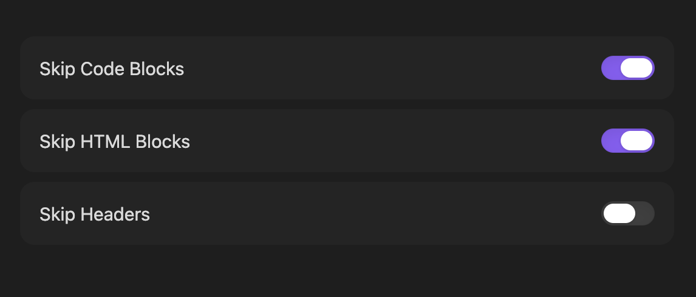

# Embed Skipper

I like to start a lot of my notes with a fancy title or header, usually from an image or a div so I can style them to my liking, my issue is that when I open those notes, my cursor is on the first line by default which turns that nice header into a bunch of ugly code. Embed Skipper skips your cursor past any embedded content such as html elements or code blocks when openening a note so you don't have to worry about that.

## Settings

You can toggle on which embed types to skip from the settings menu.

## Future Features
> *If there's anything else you want added, feel free to open an issue or pull request.*
- [ ] Regex embed parser for customizable skipping

## Support
